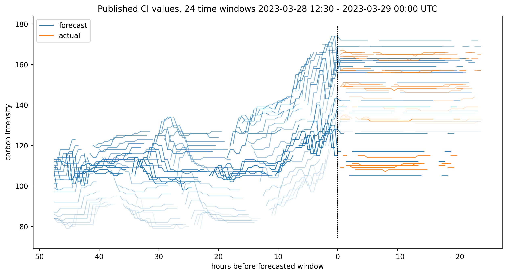
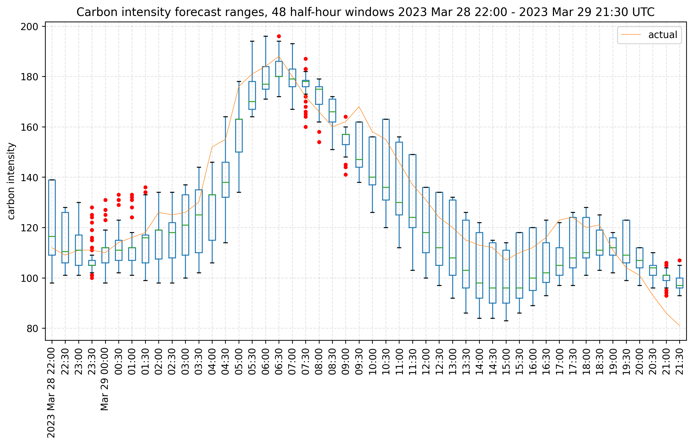
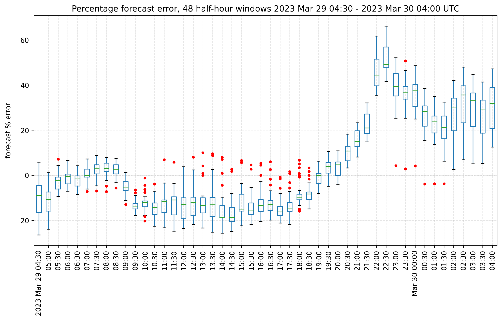

# Carbon Intensity Forecast Tracking

For the 24 hours forecasted 2023 Apr 4 15:00 - 2023 Apr 5 14:30, the forecast accuracy error was:
mean absolute: **0.2** gCO2/kWh (**10%**)
and a mean absolute percentage error of **10%**. The standard deviation of the forecast error was **0.3** gCO2/kWh (**17%**).

|            |   mean |    std |    sem | confidence_95    | confidence_99    |
|:-----------|-------:|-------:|-------:|:-----------------|:-----------------|
| 2023-03-28 |  -1.72 |   6.35 |   0.5  | (-2.7, -0.75)    | (-3.02, -0.43)   |
| 2023-03-29 |  -2.26 |  17.56 |   0.28 | (-2.81, -1.71)   | (-2.98, -1.54)   |
| 2023-03-30 |  -1.32 |  24.17 |   0.47 | (-2.25, -0.4)    | (-2.54, -0.1)    |
| 2023-04-03 |  -0.58 | nan    | nan    | (nan, nan)       | (nan, nan)       |
| 2023-04-04 |  -2.61 |  28.1  |   0.87 | (-4.31, -0.9)    | (-4.85, -0.36)   |
| 2023-04-05 | -11.5  |  16.86 |   0.4  | (-12.28, -10.72) | (-12.53, -10.47) |

## What is this?

Tracking differences between the [UK National Grid's Carbon Intensity forecast](https://carbonintensity.org.uk/) and its eventual recorded value.

The UK's National Grid Electricity System Operator (NGESO) publishes [an API](https://carbon-intensity.github.io/api-definitions/#carbon-intensity-api-v2-0-0) showing half-hourly carbon intensity (gCO2/kWh) in different GB regions, together with a 48-hour forecast. The national data is based upon real and estimated metered generation statistics and values representing the relative carbon intensity of different energy sources. Regional data is based upon forecasted generation, consumption, and a model describing inter-region interaction.

The forecasts are updated every half hour, but the API does not keep historical forecasts; they're unavailable or overwritten. How reliable are they?



The above figure shows the evolution of 24 hours' worth of time windows' national forecasts. The more recent time windows are darker blue. Each window is forecasted about 96 times in the preceeding 48 hours (left of the dashed line, from the fw48h endpoint). Right of the dashed line are a further 48 post-hoc "forecasts" and "actual" values (pt24h endpoint).

## Basic idea

- [Git scrape](https://simonwillison.net/2020/Oct/9/git-scraping/) the National Grid Carbon Intensity API using GitHub Actions, as inspired by [food-scraper](https://github.com/codeinthehole/food-scraper).
- Scraping occurs twice per hour on a [cron schedule](https://github.com/nmpowell/carbon-intensity-forecast-tracking/blob/main/.github/workflows/scrape_data.yaml) ([docs](https://docs.github.com/en/actions/using-workflows/workflow-syntax-for-github-actions)).
- Download JSON data from the [various endpoints](https://carbon-intensity.github.io/api-definitions/#intensity), and save to `data/`.
- Once per day, data is converted to CSV, and parsed into a Pandas dataframe for summarising, plotting and analysis.
- With summary statistics and plots, we can attempt to estimate the accuracy of the forecasts.

To follow the plot generation, see the `notebook.ipynb`.
To run yourself, see **Usage** below.

## Prior work

I'm unsure whether this has been done before. NGESO do not seem to release historic forecasts or figures about their accuracy. If you know more, please let me know!

Kate Rose Morley [created the canonincal great design](https://grid.iamkate.com/) for tracking the UK's live carbon intensity.

The API site shows [a graph](https://carbonintensity.org.uk/#graphs) of the forecast and "actual" values. You can create plots of a custom time range using [NGESO datasets](https://data.nationalgrideso.com/data-groups/carbon-intensity1): go to Regional/National "Carbon Intensity Forecast", click "Explore", choose "Chart", deselect "datetime" and add the regions. The "National" dataset includes the "actual" CI. But these are the final/latest values. This project aims to track the accuracy of the forecasts as they are published.

## Forecast Accuracy



The above boxplot shows the range of all published forecast values for each 30-minute time window.

- For each actual 30-minute period defined by its "from" datetime, capture published forecasts for that period.
- Forecasts are published up to 48 hours ahead, so we should expect about 96 future forecasts for one real period, and 48 more from the "past" 24 hours.
- Also capture "actual" values by choosing the latest available "actual" value (national data only) up to 24 hours after the window has passed.
- For the regional data, absent "actual" values we choose the final available forecast 24h after the window has passed (usually, this does not change).
- We can do this for each of the published regions and the National data.



The above plot shows forecast percentage error (compared with "actual" values) for the same times.

## Limitations

- Because Github's Actions runners are shared (and free), the cronjobs aren't 100% reliable. Expect occasional missing data.
- Unclear what the difference between the 18th DNO region, "GB", and the "National" forecasts are. [National](https://api.carbonintensity.org.uk/intensity/2023-03-11T22:31Z). [Regional](https://api.carbonintensity.org.uk/regional/intensity/2023-03-11T22:31Z/fw48h): at timepoint 0, regionid 18. Slightly different.

### Actual intensity and generation mix

To measure regional forecast accuracy it would be preferable to have a retrospective `actual` CI value for each region, but the API only provides this [at the national level](https://api.carbonintensity.org.uk/intensity).

From tracking the [pt24h](https://carbon-intensity.github.io/api-definitions/#get-intensity-from-pt24h) data, these "actual" values, as well as forecasts, are sometimes adjusted post-hoc, i.e. several hours after the relevant time window has passed. This is because some renewable generation data becomes available after the fact, and NGESO update their numbers. We could continue monitoring this, but we have to stop sometime. For the purposes of this project, to give an anchor against which we can measure forecast accuracy, I choose the "actual" "final forecast" values as the latest ones accessible up to 24 hours after the start of the time window.

## Data notes

### Dates and times

- All times are UTC. Seconds are ignored.
- Throughout, I represent the 30-minute time window defined by a "from" and "to" timestamp in the API using just the "from" datetime. Thus a forecasted datetime given here represents a 30-minute window beginning at that time.
- If we query the 48h forecast API at a given time e.g. 18:45, the earliest time window (the 0th entry in the data) begins at the current time rounded down to the nearest half hour, i.e. the "from" timepoint 0 will be 18:30 and represents the window covering the time requested. A wrinkle is that if you request 18:30, you'll get the window beginning 18:00, i.e. `(2023-03-10T18:00Z, 2023-03-10T18:30Z]`, so the code here always requests +1 minute from the rounded-down half-hour.
- Dates don't seem to wrap around years, [31st December - 1st Jan](https://api.carbonintensity.org.uk/regional/intensity/2022-12-31T21:31Z/fw48h).

### Regions

- There are [17 DNO regions including national](https://carbon-intensity.github.io/api-definitions/#region-list). In the 48 hour forecasts, there's an 18th region which is "GB", which may approximate the "national" forecast but doesn't match it exactly.
- The earliest regional forecast data is from [May 2018](https://api.carbonintensity.org.uk/regional/intensity/2018-05-10T23:30Z/fw48h).

## Usage

### Install

1. Clone this repository `git clone git@github.com:nmpowell/carbon-intensity-forecast-tracking.git`
2. Set up a local virtual environment using Python 3.10+
    ``` sh
    cd carbon-intensity-forecast-tracking/
    python3 -m venv venv                 # use this subdirectory name to piggyback on .gitignore
    source venv/bin/activate
    ```
3. You can install the requirements in this virtual environment in a couple of ways:
    ``` sh
    python3 -m pip install --upgrade pip
    python3 -m pip install -r requirements.txt
    # or
    make install
    ```
    `make` will call `pip-sync` which will use the `requirements.txt` file to install requirements. To regenerate that file, use `pip-compile requirements.in`


### Run

1. Activate the venv: `source venv/bin/activate`
2. Download JSON files. Examples:
    ``` sh
    # 48-hour forward forecast from the current window, default endpoint
    python3 run.py download --output_dir "data" --now
    # 24-hour past "forecasts" from the current window
    python3 run.py download --output_dir "data" --now --endpoint regional_pt24h
    # national intensity for a given time
    python3 run.py download --start_date "2023-03-13T12:01Z" -n 1 --endpoint national --unique_names
    # individual regions
    python3 run.py download_regional -o "data" --start_date "2023-03-13T12:01Z" -n 1 --endpoint one_region_fw48h
    # You can download data from many timepoints (-n 24 for 12 hours' worth), but this will be the fixed, historical data which is available forever anyway.
    python3 run.py download --output_dir "temp" --start_date "2023-03-01T12:01Z" -n 24 --endpoint national
    ```
    Output JSON files are named for the `{from}` time given: `data/<endpoint>/<from-datetime>.json`.
3. Parse the data and produce CSV files: `python3 run.py wrangle --input_directory "data/national_fw48h"`
4. Summarise the CSVs: `python3 run.py summarise --input_directory "data/national_fw48h"`
5. Generate plots: `python3 run.py plot --input_directory "data/national_fw48h"`

To copy the scraping functionality of this repo, enable GitHub Actions within your repo `Settings > Actions > General > Workflow permissions > Read and write permissions`.

### Test

Run `make test` or `pytest -v tests`

## Data storage

The JSON format isn't great for parsing and plotting, and the files are huge. So here they're wrangled (`wrangle.py`) into CSV.

"The carbon intensity of electricity is a measure of how much CO2 emissions are produced per kilowatt hour of electricity consumed." Units, including forecast values, are usually gCO2/kWh.

## Plots

- Want to show forecasts forward from a given date. It doesn't matter if we collect some past dates if we know which to ignore.

Note that there could be many contributing factors to a broad error standard deviation, including missing data (not scraped successfully).

This plot shows all the forecasted intensity values for a given half-hour window starting at the time indicated by the vertical dashed line at t=0. Forecasts are published half-hourly at the `fw48h` endpoint, up to 48 hours before a window, and 24 hours after, at the `pt24h` endpoint. 

This box plot shows the the spread of percentage error for all intensity forecasts for 12 hours prior to the given time. The error is based upon the final recorded "actual" intensity value (i.e. `actual - forecast`).

This box plot shows the the spread of percentage error for all intensity forecasts for the past 7 days.

This box plot shows the spread of all the intensity forecasts (their actual intensity values) for 12 hours prior to the given time.

Because solar and wind generation data are estimates, their values can change even post-hoc (i.e. after the time window has passed). This can be seen from the orange line in <the plot>, tracking the `pt24h` endpoint, which varies slightly over time. Therefore, I compare forecast accuracy against the last available "actual" value, which is at most 24h after the window. (Instead of the last forecast value, which is fixed, or the first available "actual" value, which is recorded just after the window has passed.)

## TODOs & future work

- [ ] fix/check time range on plots
- [ ] fix :/home/runner/work/carbon-intensity-forecast-tracking/carbon-intensity-forecast-tracking/scrape/wrangle.py:40: FutureWarning: In a future version, the Index constructor will not infer numeric dtypes when passed object-dtype sequences (matching Series behavior)"
- [ ] split summaries into smaller files, or only generate for a small date range.
- Summaries and plots for each region and DNO region
- track regions' performance i.e. lower CI
- investigate BMRS data: actual? total? https://www.bmreports.com/bmrs/?q=help/about-us

- Tests
    - saving valid json and csv
    - summary generation is idempotent

- summary measures:
    - for a given half-hour window, in a given region, with a known actual CI:
        - the spread: variance (or mean deviation) about a central point (the actual value; not the mean), stdev, interquartile range -- of the ~96 forecasts.

- make Github actions more efficient by reusing some steps
- Could overwrite a single file per endpoint, and use a tool like [git-history](https://simonwillison.net/2021/Dec/7/git-history/) to retrieve past data. Keeping the files separate is a little more transparent, though, and a bit easier for now.
