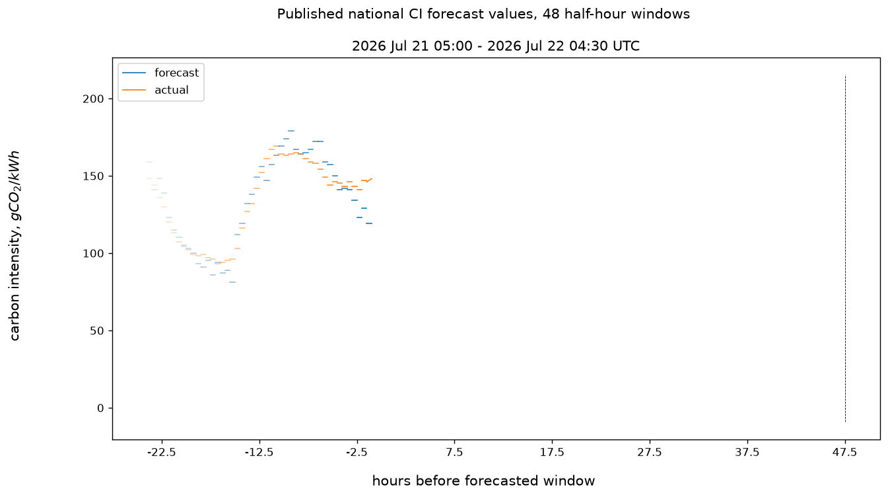
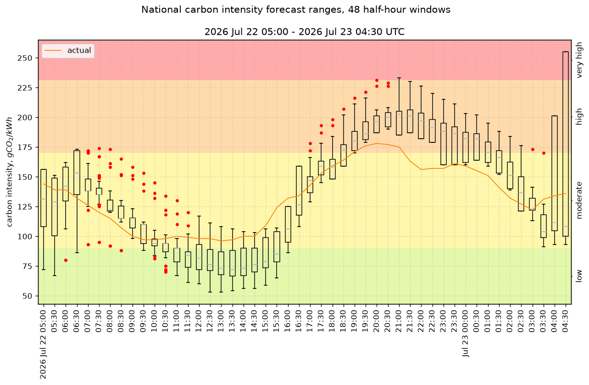
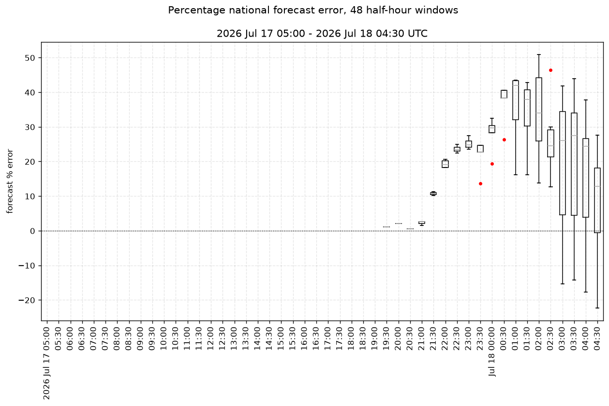
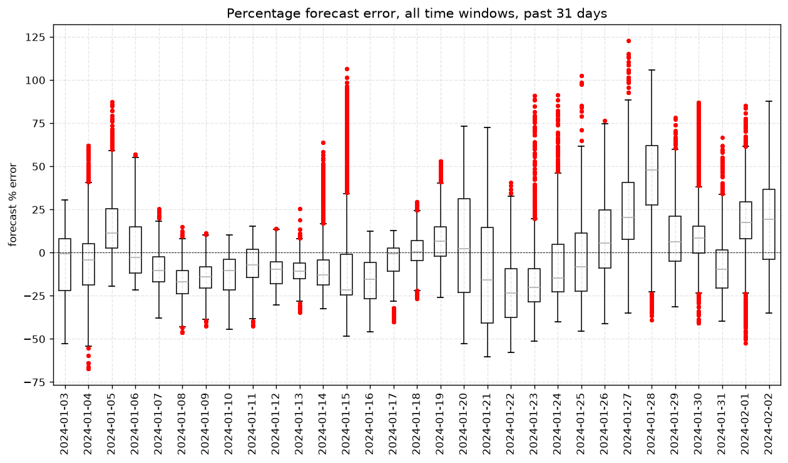
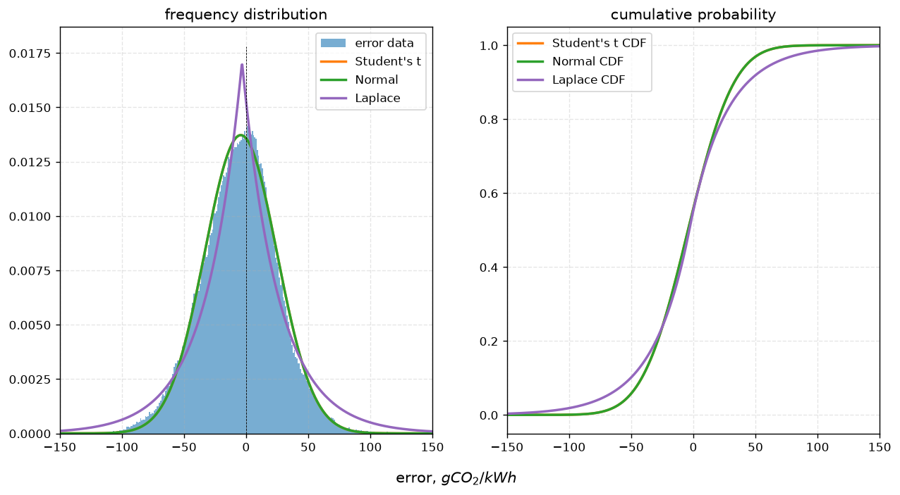

# Carbon Intensity Forecast Tracking

Tracking differences between the [UK grid's carbon intensity forecast](https://carbonintensity.org.uk/)
and its eventual recorded value.

## What is this?

See the accompanying [blog post](https://nickmp.com/posts/carbon-intensity-forecast-tracking).

The carbon intensity of electricity is a measure of the $CO_2$ emissions produced per
kilowatt-hour consumed. NESO publishes [an API](https://carbon-intensity.github.io/api-definitions/)
with half-hourly carbon intensity and a 48-hour forecast — but keeps no forecast history:
old forecasts are overwritten. This repo scrapes the API twice an hour from GitHub
Actions and commits what it sees, so the git history *is* the record, then publishes
daily accuracy statistics and charts.



Each half-hour window is forecast about 96 times over the preceding 48 hours and revised
for 24 hours afterwards; the fan above shows those trajectories converging.

## How it works

Everything lives in SQLite databases committed to the repo — no JSON or CSV data files
(design and measurements: [ADR-001](./docs/adr-001-sqlite.md)):

- **Twice hourly** (`ingest.yaml`): all five API endpoints are fetched in memory,
  validated, and written as one small inbox database (`data/db/inbox/snap_<slot>.sqlite`,
  ~130 KB).
- **Daily** (`daily.yaml`): complete days of inboxes fold into window-partitioned
  databases — `national_<YYYY-MM>` (full fidelity), `regional_<YYYY-MM>{a,b}` and
  `generation_<YYYY>` (change-log: a row is stored only when its values differ from the
  previous capture; recorded coverage makes reconstruction exact) — then every chart,
  the tables below, and `data/db/analysis.sqlite` are rebuilt.

## Forecast accuracy — national

### 24 hours





### Daily summaries

#### Absolute error, gCO2/kWh

<!-- cift:daily-stats:start -->
|            |   count |   mean |   sem |   95% CI low |   95% CI high |
|:-----------|--------:|-------:|------:|-------------:|--------------:|
| 2024-01-26 |    1892 |  10.5  |  0.17 |        10.17 |         10.83 |
| 2024-01-27 |    4234 |  23.9  |  0.25 |        23.41 |         24.39 |
| 2024-01-28 |    4313 |  33.04 |  0.21 |        32.63 |         33.46 |
| 2024-01-29 |    4287 |  24.6  |  0.24 |        24.12 |         25.07 |
| 2024-01-30 |    4320 |  22.95 |  0.23 |        22.49 |         23.41 |
| 2024-01-31 |    4320 |  18.82 |  0.2  |        18.43 |         19.21 |
| 2024-02-01 |    4276 |  26.98 |  0.25 |        26.48 |         27.48 |
| 2024-02-02 |    2314 |  18.01 |  0.24 |        17.53 |         18.49 |
<!-- cift:daily-stats:end -->

#### Absolute percentage error

<!-- cift:daily-stats-pc:start -->
|            |   mean |   sem |   95% CI low |   95% CI high |
|:-----------|-------:|------:|-------------:|--------------:|
| 2024-01-26 |  11.26 |  0.2  |        10.86 |         11.65 |
| 2024-01-27 |  27.02 |  0.35 |        26.33 |         27.7  |
| 2024-01-28 |  46.15 |  0.33 |        45.5  |         46.81 |
| 2024-01-29 |  15.82 |  0.21 |        15.41 |         16.23 |
| 2024-01-30 |  16.79 |  0.27 |        16.27 |         17.31 |
| 2024-01-31 |  14.91 |  0.16 |        14.59 |         15.24 |
| 2024-02-01 |  23.42 |  0.22 |        22.98 |         23.86 |
| 2024-02-02 |  26.57 |  0.4  |        25.79 |         27.35 |
<!-- cift:daily-stats-pc:end -->

### 30 days



### All data — absolute error

<!-- cift:all-data-summary:start -->
| n | mean | median | std | sem |
|---|---|---|---|---|
| 1281568 | 24.2580 | 20.0 | 19.5158 | 0.017239 |
<!-- cift:all-data-summary:end -->

## Forecast reliability



By fitting distributions to the error history we can estimate the probability of a
forecast error large enough to cross the published CI index bands (stored in
`data/db/reference.sqlite`).

#### Error magnitudes and their probabilities

<!-- cift:error-probabilities:start -->
|   error value |   Student's t probability |   Normal probability |   Laplace probability |
|--------------:|--------------------------:|---------------------:|----------------------:|
|           100 |                0.00388463 |          0.000687185 |             0.0333665 |
|            90 |                0.00763741 |          0.00225125  |             0.04691   |
|            80 |                0.015007   |          0.00662228  |             0.065951  |
|            70 |                0.0292448  |          0.0175163   |             0.0927207 |
|            60 |                0.0559845  |          0.0417327   |             0.130356  |
|            50 |                0.104107   |          0.0897493   |             0.183268  |
|            40 |                0.185748   |          0.174681    |             0.257657  |
|            30 |                0.314035   |          0.308701    |             0.362241  |
|            20 |                0.497533   |          0.497381    |             0.509276  |
|            10 |                0.732789   |          0.734381    |             0.715993  |
<!-- cift:error-probabilities:end -->

The daily history of these statistics lives in `data/db/analysis.sqlite`
(`stats_history`, `error_probabilities`, `all_data_error_summary`).

## Usage

Expects Python 3.13+.

```sh
python3 -m venv venv && source venv/bin/activate
make install-dev        # or install / install-minimal
make check              # linters + the test suite

python run.py ingest  --db_root data/db                   # one snapshot now
python run.py compact --db_root data/db                   # fold complete days
python run.py analyse --db_root data/db --charts charts --readme README.md
```

The one-off historical migration (JSON/CSV era → SQLite) is `python run.py migrate`;
it stages every legacy source, emits through the production write path, and refuses to
pass unless an exhaustive verification gate — including reproducing the frozen 2023
README totals — holds.

## Runbook

- **Scheduled workflows** are auto-disabled by GitHub after 60 days without commits.
  Re-enable with `gh workflow enable ingest.yaml daily.yaml`. Failure emails go to
  whoever last edited the cron lines; failures and data-health alerts also open issues.
- **A missed scrape slot is permanently lost** (the API keeps no history); ~90% capture
  is normal and reconstruction treats gaps as gaps, never as unchanged values.
- **Backlog recovery**: if the daily job is down for a while, inboxes accumulate
  harmlessly; each daily run folds up to 600, oldest first — just let it catch up or
  dispatch it repeatedly.
- **Quarantine**: an inbox older than already-merged captures is moved to
  `data/db/inbox/quarantine/` rather than corrupting the change-log; inspect manually.
- **Size tripwire**: compaction fails loudly if a partition would exceed 85 MiB
  (GitHub blocks files at 100 MB); see ADR-001 before changing anything.

## Prior work

Kate Rose Morley's [grid.iamkate.com](https://grid.iamkate.com/) is the canonical live
view. NESO's [data portal](https://www.neso.energy/data-portal) publishes final values;
this project tracks the accuracy of forecasts *as they were published*.
