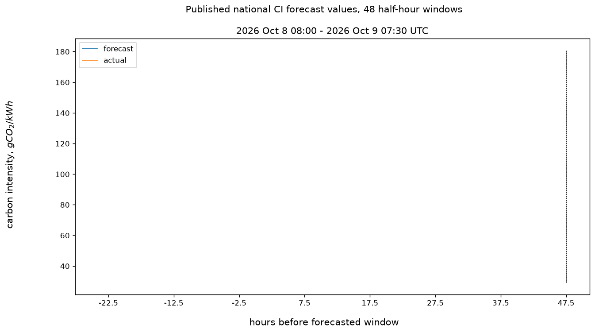
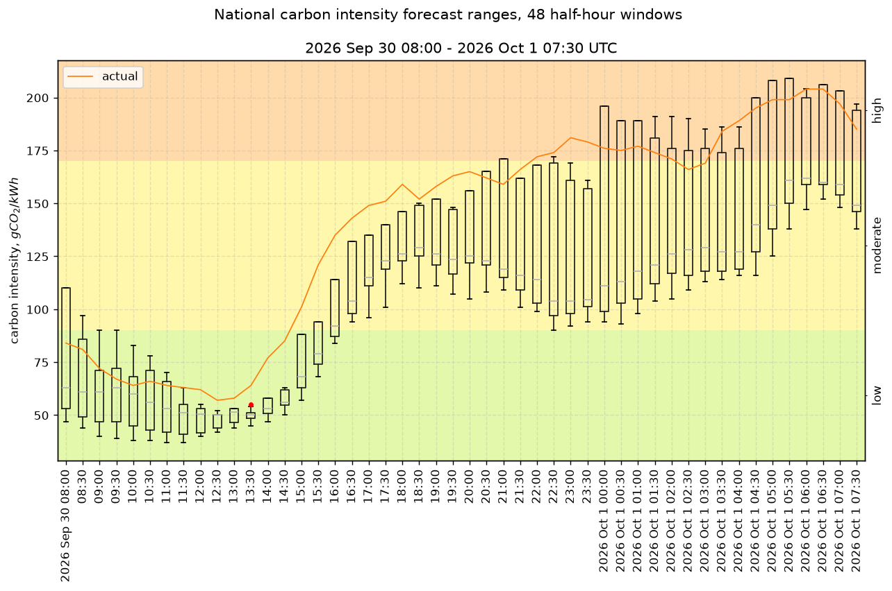
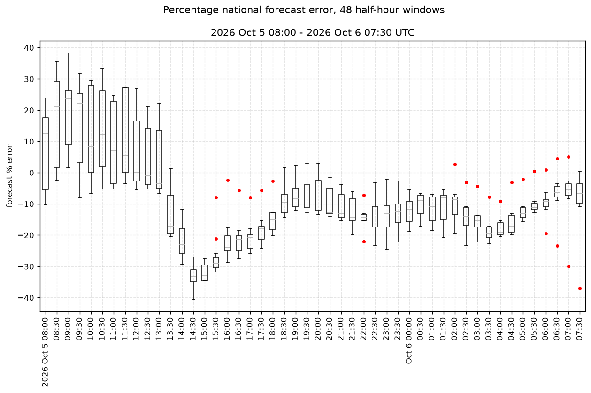
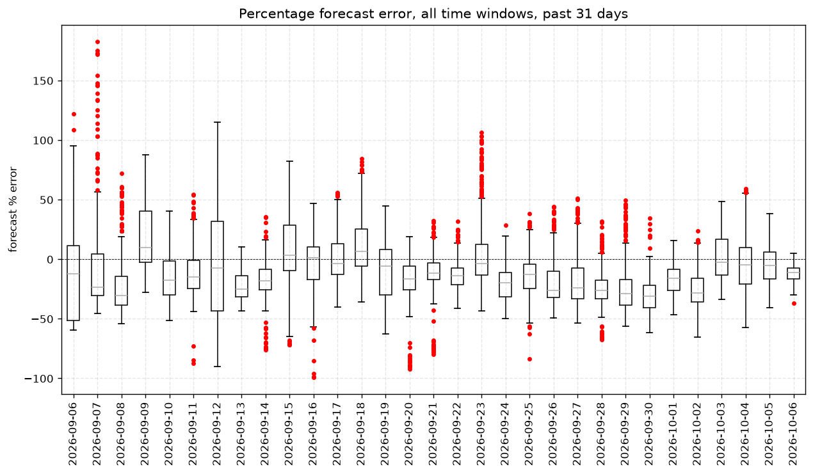
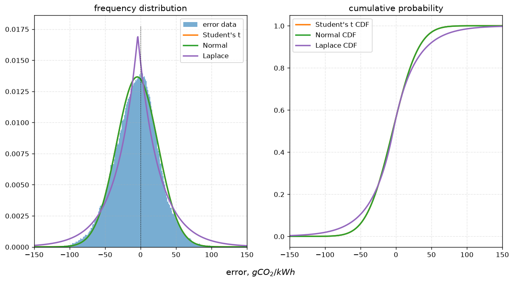

# Carbon Intensity Forecast Tracking

Tracking differences between the [UK grid's carbon intensity forecast](https://carbonintensity.org.uk/)
and its eventual recorded value.

## What is this?

See the accompanying [blog post](https://nickmp.com/posts/carbon-intensity-forecast-tracking).

The carbon intensity of electricity is a measure of the $CO_2$ emissions produced per
kilowatt-hour consumed. NESO publishes [an API](https://carbon-intensity.github.io/api-definitions/)
with half-hourly carbon intensity and a 48-hour forecast — but keeps no forecast history:
old forecasts are overwritten. This repo scrapes the API twice an hour from GitHub
Actions and commits what it sees, so the git history *is* the record, then publishes
daily accuracy statistics and charts.



Each half-hour window is forecast about 96 times over the preceding 48 hours and revised
for 24 hours afterwards; the fan above shows those trajectories converging.

## How it works

Everything lives in SQLite databases committed to the repo — no JSON or CSV data files
(design and measurements: [ADR-001](./docs/adr-001-sqlite.md)):

- **Twice hourly** (`ingest.yaml`): all five API endpoints are fetched in memory,
  validated, and written as one small inbox database (`data/db/inbox/snap_<slot>.sqlite`,
  ~130 KB).
- **Daily** (`daily.yaml`): complete days of inboxes fold into window-partitioned
  databases — `national_<YYYY-MM>` (full fidelity), `regional_<YYYY-MM>{a,b}` and
  `generation_<YYYY>` (change-log: a row is stored only when its values differ from the
  previous capture; recorded coverage makes reconstruction exact) — then every chart,
  the tables below, and `data/db/analysis.sqlite` are rebuilt.

## Forecast accuracy — national

### 24 hours





### Daily summaries

#### Absolute error, gCO2/kWh

<!-- cift:daily-stats:start -->
|            |   count |   mean |   sem |   95% CI low |   95% CI high |
|:-----------|--------:|-------:|------:|-------------:|--------------:|
| 2026-09-29 |     357 |  32.79 |  0.99 |        30.84 |         34.74 |
| 2026-09-30 |     526 |  35.23 |  0.89 |        33.49 |         36.97 |
| 2026-10-01 |     546 |  31.36 |  0.88 |        29.62 |         33.09 |
| 2026-10-02 |     540 |  34.76 |  0.95 |        32.9  |         36.63 |
| 2026-10-03 |     563 |  21.08 |  0.54 |        20.02 |         22.15 |
| 2026-10-04 |     606 |  19.77 |  0.68 |        18.43 |         21.11 |
| 2026-10-05 |     587 |  16.34 |  0.54 |        15.28 |         17.41 |
| 2026-10-06 |     175 |  25.04 |  0.96 |        23.14 |         26.94 |
<!-- cift:daily-stats:end -->

#### Absolute percentage error

<!-- cift:daily-stats-pc:start -->
|            |   mean |   sem |   95% CI low |   95% CI high |
|:-----------|-------:|------:|-------------:|--------------:|
| 2026-09-29 |  31.52 |  0.66 |        30.22 |         32.83 |
| 2026-09-30 |  31.4  |  0.54 |        30.33 |         32.47 |
| 2026-10-01 |  18.23 |  0.49 |        17.28 |         19.19 |
| 2026-10-02 |  26.69 |  0.58 |        25.55 |         27.83 |
| 2026-10-03 |  15.38 |  0.41 |        14.58 |         16.19 |
| 2026-10-04 |  17.92 |  0.53 |        16.88 |         18.96 |
| 2026-10-05 |  13.67 |  0.39 |        12.91 |         14.43 |
| 2026-10-06 |  12.05 |  0.45 |        11.16 |         12.94 |
<!-- cift:daily-stats-pc:end -->

### 30 days



### All data — absolute error

<!-- cift:all-data-summary:start -->
| n | mean | median | std | sem |
|---|---|---|---|---|
| 1375245 | 24.3911 | 20.0 | 19.6049 | 0.016718 |
<!-- cift:all-data-summary:end -->

## Forecast reliability



By fitting distributions to the error history we can estimate the probability of a
forecast error large enough to cross the published CI index bands (stored in
`data/db/reference.sqlite`).

#### Error magnitudes and their probabilities

<!-- cift:error-probabilities:start -->
|   error value |   Student's t probability |   Normal probability |   Laplace probability |
|--------------:|--------------------------:|---------------------:|----------------------:|
|           100 |                0.00403172 |          0.000744778 |             0.0339728 |
|            90 |                0.00790482 |          0.00240593  |             0.04769   |
|            80 |                0.0154825  |          0.0069879   |             0.066946  |
|            70 |                0.0300603  |          0.0182744   |             0.093977  |
|            60 |                0.0573084  |          0.0431052   |             0.131922  |
|            50 |                0.106094   |          0.0919023   |             0.185189  |
|            40 |                0.188419   |          0.17757     |             0.259964  |
|            30 |                0.317117   |          0.311942    |             0.36493   |
|            20 |                0.500374   |          0.500261    |             0.512279  |
|            10 |                0.734526   |          0.736092    |             0.719123  |
<!-- cift:error-probabilities:end -->

The daily history of these statistics lives in `data/db/analysis.sqlite`
(`stats_history`, `error_probabilities`, `all_data_error_summary`).

## Usage

Expects Python 3.13+.

```sh
python3 -m venv venv && source venv/bin/activate
make install-dev        # or install / install-minimal
make check              # linters + the test suite

python run.py ingest  --db_root data/db                   # one snapshot now
python run.py compact --db_root data/db                   # fold complete days
python run.py analyse --db_root data/db --charts charts --readme README.md
```

The one-off historical migration (JSON/CSV era → SQLite) is `python run.py migrate`;
it stages every legacy source, emits through the production write path, and refuses to
pass unless an exhaustive verification gate — including reproducing the frozen 2023
README totals — holds.

## Runbook

- **Scheduled workflows** are auto-disabled by GitHub after 60 days without commits.
  Re-enable with `gh workflow enable ingest.yaml daily.yaml`. Failure emails go to
  whoever last edited the cron lines; failures and data-health alerts also open issues.
- **A missed scrape slot is permanently lost** (the API keeps no history); ~90% capture
  is normal and reconstruction treats gaps as gaps, never as unchanged values.
- **Backlog recovery**: if the daily job is down for a while, inboxes accumulate
  harmlessly; each daily run folds up to 600, oldest first — just let it catch up or
  dispatch it repeatedly.
- **Quarantine**: an inbox older than already-merged captures is moved to
  `data/db/inbox/quarantine/` rather than corrupting the change-log; inspect manually.
- **Size tripwire**: compaction fails loudly if a partition would exceed 85 MiB
  (GitHub blocks files at 100 MB); see ADR-001 before changing anything.

## Prior work

Kate Rose Morley's [grid.iamkate.com](https://grid.iamkate.com/) is the canonical live
view. NESO's [data portal](https://www.neso.energy/data-portal) publishes final values;
this project tracks the accuracy of forecasts *as they were published*.
