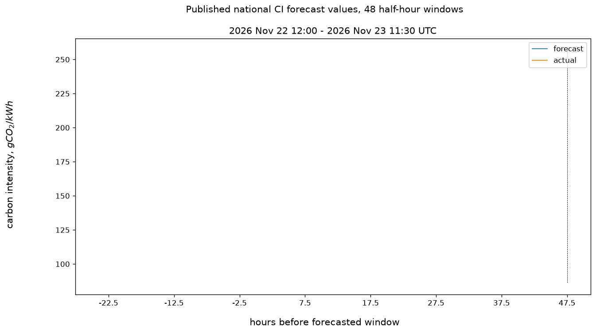
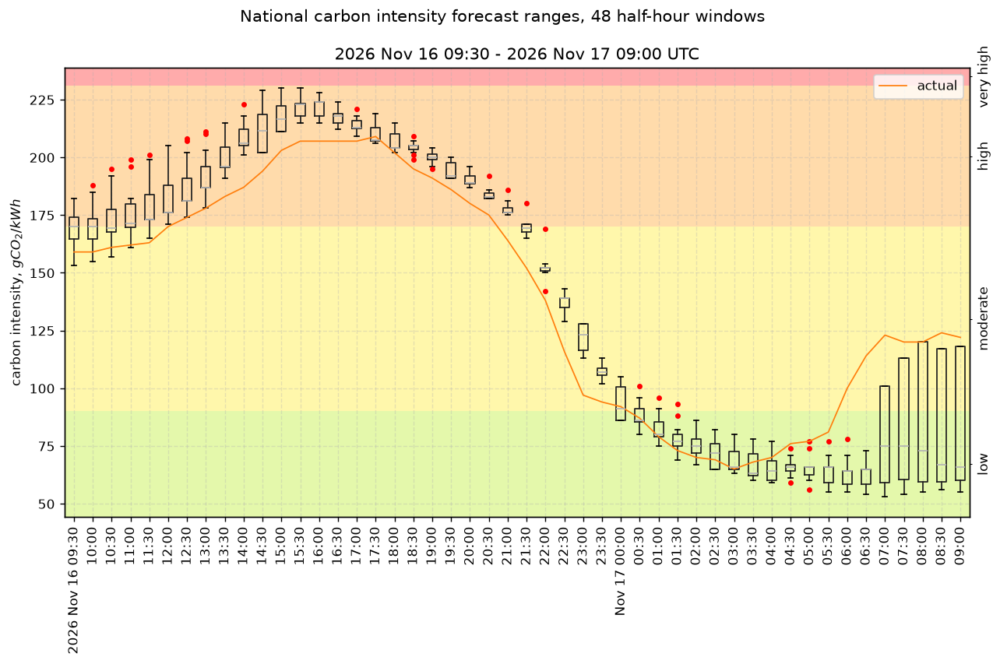
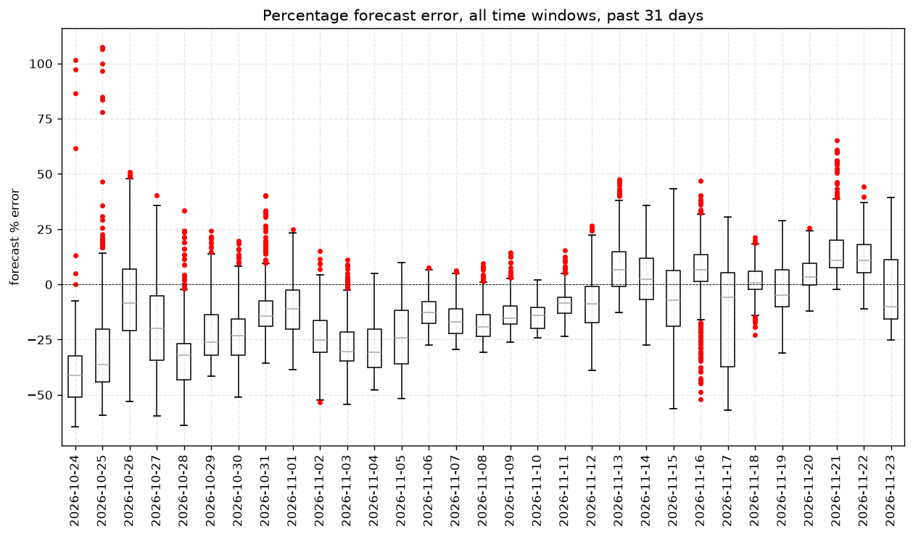

# Carbon Intensity Forecast Tracking

Tracking differences between the [UK grid's carbon intensity forecast](https://carbonintensity.org.uk/)
and its eventual recorded value.

## What is this?

See the accompanying [blog post](https://nickmp.com/posts/carbon-intensity-forecast-tracking).

The carbon intensity of electricity is a measure of the $CO_2$ emissions produced per
kilowatt-hour consumed. NESO publishes [an API](https://carbon-intensity.github.io/api-definitions/)
with half-hourly carbon intensity and a 48-hour forecast — but keeps no forecast history:
old forecasts are overwritten. This repo scrapes the API twice an hour from GitHub
Actions and commits what it sees, so the git history *is* the record, then publishes
daily accuracy statistics and charts.



Each half-hour window is forecast about 96 times over the preceding 48 hours and revised
for 24 hours afterwards; the fan above shows those trajectories converging.

## How it works

Everything lives in SQLite databases committed to the repo — no JSON or CSV data files
(design and measurements: [ADR-001](./docs/adr-001-sqlite.md)):

- **Twice hourly** (`ingest.yaml`): all five API endpoints are fetched in memory,
  validated, and written as one small inbox database (`data/db/inbox/snap_<slot>.sqlite`,
  ~130 KB).
- **Daily** (`daily.yaml`): complete days of inboxes fold into window-partitioned
  databases — `national_<YYYY-MM>` (full fidelity), `regional_<YYYY-MM>{a,b}` and
  `generation_<YYYY>` (change-log: a row is stored only when its values differ from the
  previous capture; recorded coverage makes reconstruction exact) — then every chart,
  the tables below, and `data/db/analysis.sqlite` are rebuilt.

## Forecast accuracy — national

### 24 hours




### Daily summaries

#### Absolute error, gCO2/kWh

<!-- cift:daily-stats:start -->
|            |   count |   mean |   sem |   95% CI low |   95% CI high |
|:-----------|--------:|-------:|------:|-------------:|--------------:|
| 2026-11-18 |     214 |   9    |  0.59 |         7.83 |         10.18 |
| 2026-11-19 |     397 |  17.39 |  0.53 |        16.36 |         18.43 |
| 2026-11-20 |     402 |  13.81 |  0.51 |        12.81 |         14.81 |
| 2026-11-21 |     417 |  26.43 |  0.74 |        24.98 |         27.88 |
| 2026-11-22 |     443 |  13.83 |  0.44 |        12.97 |         14.68 |
| 2026-11-23 |     408 |  34.74 |  0.74 |        33.28 |         36.2  |
| 2026-11-24 |     321 |  71.24 |  1.01 |        69.25 |         73.24 |
| 2026-11-25 |     124 |  60.65 |  1.81 |        57.07 |         64.24 |
<!-- cift:daily-stats:end -->

#### Absolute percentage error

<!-- cift:daily-stats-pc:start -->
|            |   mean |   sem |   95% CI low |   95% CI high |
|:-----------|-------:|------:|-------------:|--------------:|
| 2026-11-18 |   5.03 |  0.35 |         4.34 |          5.72 |
| 2026-11-19 |   9.91 |  0.32 |         9.28 |         10.54 |
| 2026-11-20 |   7.23 |  0.3  |         6.64 |          7.82 |
| 2026-11-21 |  15.32 |  0.61 |        14.13 |         16.52 |
| 2026-11-22 |  12.54 |  0.4  |        11.76 |         13.32 |
| 2026-11-23 |  17.86 |  0.45 |        16.98 |         18.74 |
| 2026-11-24 |  45.63 |  0.68 |        44.29 |         46.97 |
| 2026-11-25 |  39.18 |  1.09 |        37.02 |         41.33 |
<!-- cift:daily-stats-pc:end -->

### 30 days



### All data — absolute error

<!-- cift:all-data-summary:start -->
| n | mean | median | std | sem |
|---|---|---|---|---|
| 1400326 | 24.4432 | 20.0 | 19.6198 | 0.016580 |
<!-- cift:all-data-summary:end -->

## Forecast reliability


By fitting distributions to the error history we can estimate the probability of a
forecast error large enough to cross the published CI index bands (stored in
`data/db/reference.sqlite`).

#### Error magnitudes and their probabilities

<!-- cift:error-probabilities:start -->
|   error value |   Student's t probability |   Normal probability |   Laplace probability |
|--------------:|--------------------------:|---------------------:|----------------------:|
|           100 |                 0.0039682 |          0.000774334 |             0.0341856 |
|            90 |                 0.0078364 |          0.00248447  |             0.0479608 |
|            80 |                 0.0154379 |          0.00717179  |             0.0672869 |
|            70 |                 0.0301024 |          0.0186525   |             0.0944004 |
|            60 |                 0.0575446 |          0.0437846   |             0.13244   |
|            50 |                 0.10666   |          0.0929612   |             0.185807  |
|            40 |                 0.189409  |          0.178984    |             0.260678  |
|            30 |                 0.31846   |          0.313522    |             0.36572   |
|            20 |                 0.50174   |          0.50166     |             0.513088  |
|            10 |                 0.735407  |          0.736922    |             0.71984   |
<!-- cift:error-probabilities:end -->

The daily history of these statistics lives in `data/db/analysis.sqlite`
(`stats_history`, `error_probabilities`, `all_data_error_summary`).

## Usage

Expects Python 3.13+.

```sh
python3 -m venv venv && source venv/bin/activate
make install-dev        # or install / install-minimal
make check              # linters + the test suite

python run.py ingest  --db_root data/db                   # one snapshot now
python run.py compact --db_root data/db                   # fold complete days
python run.py analyse --db_root data/db --charts charts --readme README.md
```

The one-off historical migration (JSON/CSV era → SQLite) is `python run.py migrate`;
it stages every legacy source, emits through the production write path, and refuses to
pass unless an exhaustive verification gate — including reproducing the frozen 2023
README totals — holds.

## Runbook

- **Scheduled workflows** are auto-disabled by GitHub after 60 days without commits.
  Re-enable with `gh workflow enable ingest.yaml daily.yaml`. Failure emails go to
  whoever last edited the cron lines; failures and data-health alerts also open issues.
- **A missed scrape slot is permanently lost** (the API keeps no history); ~90% capture
  is normal and reconstruction treats gaps as gaps, never as unchanged values.
- **Backlog recovery**: if the daily job is down for a while, inboxes accumulate
  harmlessly; each daily run folds up to 600, oldest first — just let it catch up or
  dispatch it repeatedly.
- **Quarantine**: an inbox older than already-merged captures is moved to
  `data/db/inbox/quarantine/` rather than corrupting the change-log; inspect manually.
- **Size tripwire**: compaction fails loudly if a partition would exceed 85 MiB
  (GitHub blocks files at 100 MB); see ADR-001 before changing anything.

## Prior work

Kate Rose Morley's [grid.iamkate.com](https://grid.iamkate.com/) is the canonical live
view. NESO's [data portal](https://www.neso.energy/data-portal) publishes final values;
this project tracks the accuracy of forecasts *as they were published*.
