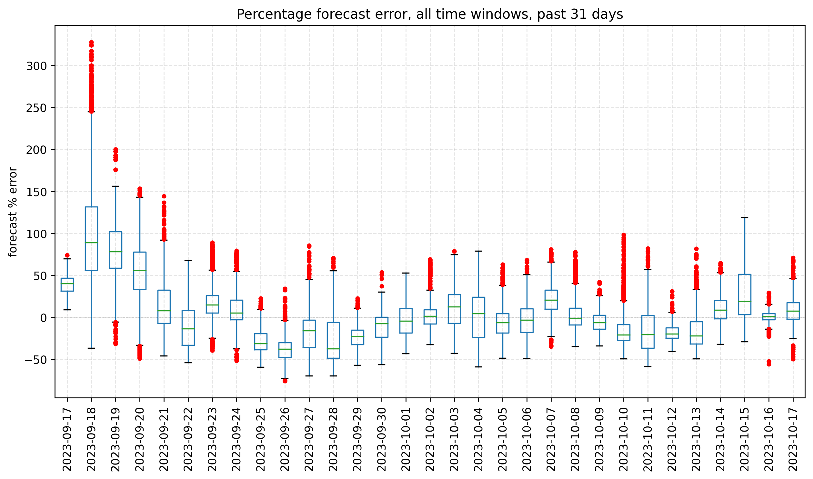

# Carbon Intensity Forecast Tracking

Tracking differences between the [UK National Grid's Carbon Intensity forecast](https://carbonintensity.org.uk/) and its eventual recorded value.

## What is this?

See accompanying [blog post](https://nickmp.com/posts/carbon-intensity-forecast-tracking).

The carbon intensity of electricity is a measure of the $CO_2$ emissions produced per kilowatt-hour (kWh) of electricity consumed. Units are usually grams of $CO_2$ per kWh.

The UK's National Grid Electricity System Operator (NGESO) publishes [an API](https://carbon-intensity.github.io/api-definitions/#carbon-intensity-api-v2-0-0) showing half-hourly carbon intensity (CI), together with a 48-hour forecast. Its national data is based upon recorded and estimated generation statistics and values representing the relative CI of different energy sources. Regional data is based upon forecasted generation, consumption, and a model describing inter-region interaction.

The forecasts are updated every half hour, but the API does not keep historical forecasts; they're unavailable or overwritten. How reliable are they?


The above figure shows the evolution of 24 hours' worth of time windows' national forecasts. The more recent time windows are darker blue. Each window is forecasted about 96 times in the preceeding 48 hours, from the `fw48h` endpoint (left of the dashed line). A further 48 post-hoc "forecasts" and "actual" values, from the `pt24h` endpoint, are shown to the right of the dashed line.

## Basic idea

- [Git scrape](https://simonwillison.net/2020/Oct/9/git-scraping/) the National Grid Carbon Intensity API using GitHub Actions, as inspired by [food-scraper](https://github.com/codeinthehole/food-scraper).
- Scraping occurs twice per hour on a [cron schedule](https://github.com/nmpowell/carbon-intensity-forecast-tracking/blob/main/.github/workflows/scrape_data.yaml) ([docs](https://docs.github.com/en/actions/using-workflows/workflow-syntax-for-github-actions)).
- Download JSON data from the [various endpoints](https://carbon-intensity.github.io/api-definitions/#intensity), and save to `data/`.
- Once per day, data is converted to CSV, and parsed into a Pandas dataframe for summarising, plotting and analysis. The plots on this page are updated daily.
- With summary statistics and plots, we can attempt to estimate the accuracy and reliability of the forecasts, and predict the likelihood of errors.

### Notebooks

- To follow plot generation, see [./notebook.ipynb](./notebook.ipynb).
- An [./investigation.ipynb](./investigation.ipynb) of past and present data.
- To run this yourself, see **Usage** below.

## Forecast Accuracy - National

For the complete history since the start of this project, see [./charts/stats_history_national.csv](./charts/stats_history_national.csv).

### 24 hours

This boxplot shows the range of all published forecast values for each 30-minute time window, defined by its "from" datetime in the API.


The plot below shows forecast percentage error (compared with "actual" values, i.e. $100\times(forecast-actual)/actual$) for the same times.


### 7-day summary

These are daily summaries of forecast error from all 48 half-hour windows on each day.

#### Absolute error, gCO2/kWh

|            |   count |   mean |   sem | 95% confidence interval   |
|:-----------|--------:|-------:|------:|:--------------------------|
| 2023-09-14 |    4050 |  21.52 |  0.22 | (21.08, 21.95)            |
| 2023-09-15 |    4320 |  19.75 |  0.35 | (19.06, 20.44)            |
| 2023-09-16 |    4320 |  26.58 |  0.33 | (25.94, 27.23)            |
| 2023-09-17 |    4320 |  20.93 |  0.21 | (20.51, 21.35)            |
| 2023-09-18 |    4320 |  58.23 |  0.3  | (57.65, 58.81)            |
| 2023-09-19 |    4320 |  46.58 |  0.25 | (46.08, 47.07)            |
| 2023-09-20 |    4320 |  37.62 |  0.24 | (37.15, 38.1)             |
| 2023-09-21 |     270 |  43.56 |  0.85 | (41.88, 45.24)            |

#### Absolute percentage error

|            |   mean |   sem | 95% confidence interval   |
|:-----------|-------:|------:|:--------------------------|
| 2023-09-14 |  13.39 |  0.2  | (13.0, 13.79)             |
| 2023-09-15 |  12.16 |  0.27 | (11.63, 12.69)            |
| 2023-09-16 |  19.98 |  0.27 | (19.44, 20.51)            |
| 2023-09-17 |  17.39 |  0.19 | (17.03, 17.76)            |
| 2023-09-18 | 104.26 |  1    | (102.3, 106.23)           |
| 2023-09-19 |  78.13 |  0.49 | (77.17, 79.09)            |
| 2023-09-20 |  57.62 |  0.46 | (56.72, 58.53)            |
| 2023-09-21 |  49.09 |  1.08 | (46.97, 51.21)            |

### 30 days



### All data summary - absolute error

|                |   count |    mean |   median |     std |       sem |
|:---------------|--------:|--------:|---------:|--------:|----------:|
| absolute error |  747250 | 24.5169 |       20 | 19.2509 | 0.0222698 |

## Forecast reliability

The next plot shows the relative frequency of all errors to date with respect to their size. By fitting a distribution, we can estimate the probability of future forecast errors of a certain magnitude, and hence decide whether to rely upon a given forecast.


By comparing with the [published numerical bands](./data/artifacts/ci_index_numerical_bands.csv) representing the CI index, we can decide the magnitude of acceptable error. For example, [to cross two bands (from low to high)](./data/artifacts/ci_index_numerical_band_error_scales.csv) in 2023 requires an error of at least 81 $gCO_2/kWh$. Given the Normal distribution fits the data quite well[^1], the chance of seeing an error this large is (as of this writing) around 0.34%.

If we check the CI forecast at a given time (via an app or the API directly), making some assumptions about the independence of the forecasts, the chances of seeing a large enough error to cross two bands (in either direction) is currently reasonably small. To cross from the middle of one band to the adjacent band naturally requires a smaller error, and this is correspondingly more likely.

Note that the bands narrow and their upper bounds reduce, year on year, to 2030. In 2023, to cross from mid-low to moderate, or mid-moderate to high, would require an error of only about 40 $gCO_2/kWh$, with a probability of about 14%. In 2025, these figures will be 32.5 $gCO_2/kWh$ and around 23%, respectively. In 2030, they will be around 17.5 $gCO_2/kWh$ and 52% (assuming current error rates). To cross two bands in 2030, e.g. from very low to moderate, will require an error of about 46 $gCO_2/kWh$, with a 9% probability.

These rates suggest we should hope to see some improvement in forecast accuracy if it is to continue to be reliable.

#### Error magnitudes and their probabilities

|   error value |   Student's t probability |   Normal probability |   Laplace probability |
|--------------:|--------------------------:|---------------------:|----------------------:|
|           100 |               0.000735272 |          0.000734891 |             0.0326199 |
|            90 |               0.00239193  |          0.00239091  |             0.0461    |
|            80 |               0.00698049  |          0.0069781   |             0.0651509 |
|            70 |               0.0183082   |          0.0183033   |             0.0920746 |
|            60 |               0.0432467   |          0.0432379   |             0.130125  |
|            50 |               0.0922346   |          0.0922208   |             0.183899  |
|            40 |               0.178141    |          0.178123    |             0.259895  |
|            30 |               0.312694    |          0.312673    |             0.367297  |
|            20 |               0.501001    |          0.500982    |             0.519082  |
|            10 |               0.736558    |          0.736547    |             0.733594  |

## Prior work

I'm unsure whether this has been done before. NGESO do not seem to release historic forecasts or figures about their accuracy. If you know more, please [open an Issue](https://github.com/nmpowell/carbon-intensity-forecast-tracking/issues/new) or [get in touch](https://nickmp.com)!

Kate Rose Morley created the [canonincal great design](https://grid.iamkate.com/) for viewing the UK's live carbon intensity.

The API site shows [a graph](https://carbonintensity.org.uk/#graphs) of the forecast and "actual" values. You can create plots of a custom time range using [NGESO datasets](https://data.nationalgrideso.com/data-groups/carbon-intensity1): go to Regional/National "Carbon Intensity Forecast", click "Explore", choose "Chart", deselect "datetime" and add the regions. The "National" dataset includes the "actual" CI. But these are the final/latest values, and as far as I know they're not statistically compared. This project aims to track the accuracy of the forecasts _as they are published_.

## APIs and Data

- The JSON format isn't great for parsing and plotting, and the files are huge. So here they're wrangled (`wrangle.py`) to CSV.

### National

1. For each actual 30-minute period defined by its "from" datetime, capture published forecasts for that period.
2. Forecasts are published up to 48 hours ahead, so we should expect about 96 future forecasts for one real period, and 48 more from the "past" 24 hours.
3. Also capture "actual" values by choosing the latest available "actual" value (national data only) up to 24 hours after the window has passed.
- We can do this for each of the published regions and the National data.

### Regional

To do!

- For the regional data, absent "actual" values we should choose the final available forecast 24h after the window has passed (usually, this does not change).
- There are [17 DNO regions including national](https://carbon-intensity.github.io/api-definitions/#region-list). In the 48 hour forecasts, there's an 18th region which is "GB", which may approximate the "national" forecast but doesn't match it exactly. (Unclear what this is.)
- The earliest regional forecast data is from [May 2018](https://api.carbonintensity.org.uk/regional/intensity/2018-05-10T23:30Z/fw48h).

### Dates and times

- All times are UTC. Seconds are ignored.
- Throughout, I represent the 30-minute time window defined by a "from" and "to" timestamp in the API using just the "from" datetime. Thus a forecasted datetime given here represents a 30-minute window beginning at that time.
- If we query the 48h forecast API at a given time e.g. 18:45, the earliest time window (the 0th entry in the data) begins at the current time rounded down to the nearest half hour, i.e. the "from" timepoint 0 will be 18:30 and represents the window covering the time requested. A wrinkle is that if you request 18:30, you'll get the window beginning 18:00, i.e. `(2023-03-10T18:00Z, 2023-03-10T18:30Z]`, so the code here always requests +1 minute from the rounded-down half-hour.
- Dates from the API don't seem to wrap around years, [31st December - 1st Jan](https://api.carbonintensity.org.uk/regional/intensity/2022-12-31T21:31Z/fw48h).

## Limitations

- Because Github's Actions runners are shared (and free), the cronjobs aren't 100% reliable. Expect occasional missing data.
- There could be many contributing factors to broad error standard deviation, including missing data (not scraped successfully).
- Most statistics assume forecasts are independent. I do not have access to the models themselves, but I think this is likely not the case: forecasts are probably weighted by prior forecasts.

### Actual intensity and generation mix

The "actual" CI values are of course indicative rather than precise measurements.

From tracking the [pt24h](https://carbon-intensity.github.io/api-definitions/#get-intensity-from-pt24h) data, these "actual" values are sometimes adjusted post-hoc, i.e. several hours after the relevant time window has passed. This is because some renewable generation data becomes available after the fact, and NGESO update their numbers. We could continue monitoring this, but we have to stop sometime. For the purposes of this project, to give an anchor against which to measure forecast accuracy, I choose the "actual" and "final forecast" values as the latest ones accessible up to 24 hours after the start of the time window, from the `pt24h` endpoint.

To measure regional forecast accuracy it would be preferable to have a retrospective `actual` CI value for each region, but the API only provides this [at the national level](https://api.carbonintensity.org.uk/intensity).

## Usage

Expects Python 3.10+.

### Install

1. Clone this repository `git clone git@github.com:nmpowell/carbon-intensity-forecast-tracking.git`
2. Set up a local virtual environment using Python 3.10+
    ``` sh
    cd carbon-intensity-forecast-tracking/
    python3 -m venv venv                 # use this subdirectory name to piggyback on .gitignore
    source venv/bin/activate
    ```
3. You can install the requirements in this virtual environment in a couple of ways:
    ``` sh
    python3 -m pip install --upgrade pip
    python3 -m pip install -r requirements.txt
    # or
    make install
    # or for development
    make install-dev
    ```
    `make` will call `pip-sync` which will use the `requirements.txt` file to install requirements. To regenerate that file, use `pip-compile requirements.in`


### Run

There are examples of downloading and parsing data in the `.github/workflows/scrape_data.yaml` and `.github/workflows/wrangle.yaml` files. For more details, see [./notebook.ipynb](./notebook.ipynb).

1. Activate the venv: `source venv/bin/activate`
2. Download JSON files. Example:
    ``` sh
    # 48-hour forward forecast from the current window, national data
    python3 run.py download --output_dir "data" --now --endpoint national_fw48h
    ```
    Output JSON files are named for the `{from}` time given: `data/<endpoint>/<from-datetime>.json`.
3. Parse the data and produce CSV files: `python3 run.py wrangle --input_directory "data/national_fw48h"`
4. Summarise the CSVs: `python3 run.py summary --input_directory "data/national_fw48h" --output_directory "data" --endpoint "national_fw48h"`. Old CSVs are moved to an `_archive` subdirectory.
5. Generate plots: `python3 run.py graph --input_directory "data" --output_directory "charts"`

To copy the scraping functionality of this repo, enable GitHub Actions within your repo `Settings > Actions > General > Workflow permissions > Read and write permissions`.

## Future work

See [TODO.md](./TODO.md)

---

[^1]: Student's t distribution closely follows the Normal as the degrees of freedom are large.
